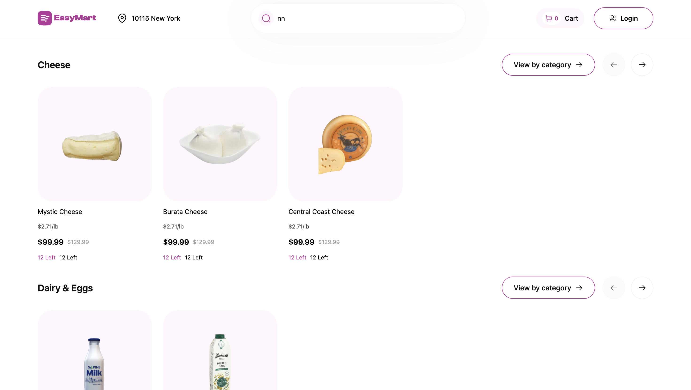
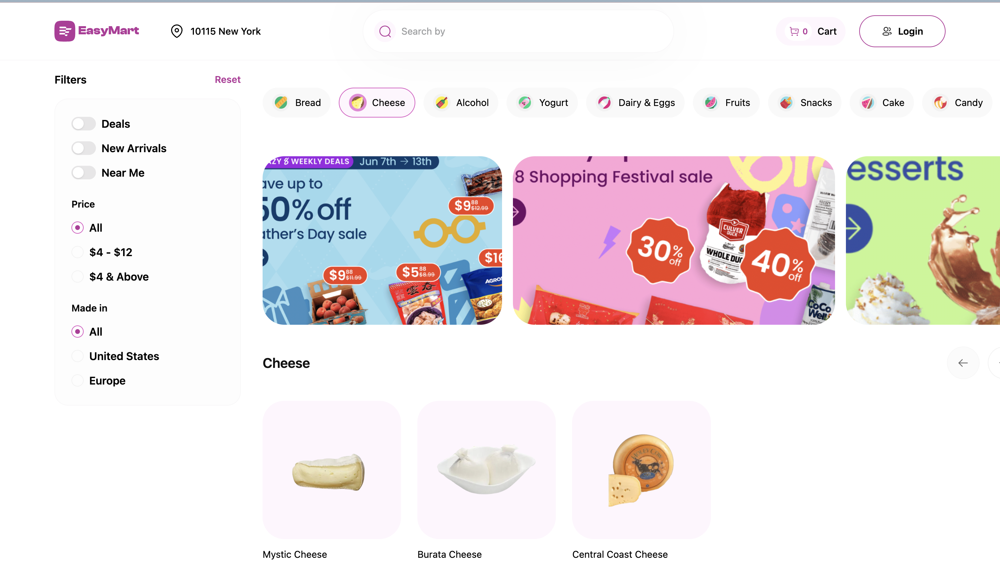
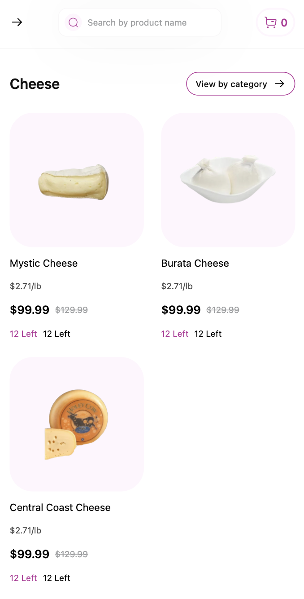
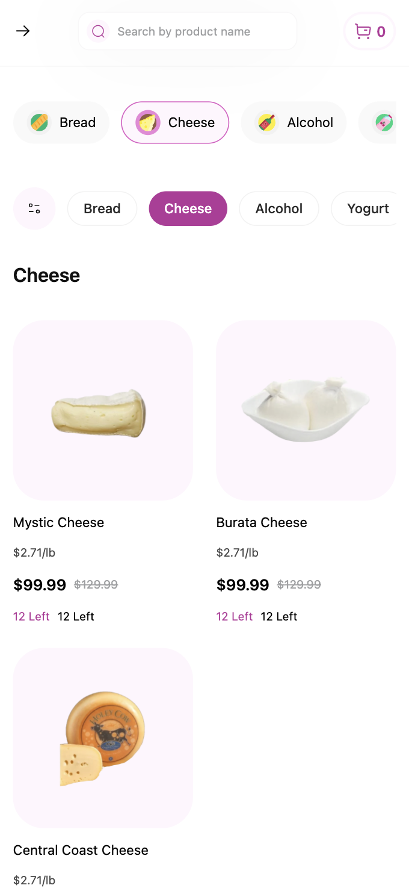

# 🛒 EasyMart — E-Commerce Frontend

EasyMart is a responsive, high-performance e-commerce frontend built with **React, TypeScript, Redux Toolkit, and Tailwind CSS**, following scalable architecture and production-grade best practices.

The project focuses on pixel-perfect UI, clean state management, mock API driven data flow, and performance optimizations such as code-splitting, lazy loading, and skeleton loaders.

---

## 🔗 Live Demo

👉 https://easy-mart-website.netlify.app/

---

## 📸 Screenshots

### Home Page


### Category Page


### Mobile View


### Mobile View 2


---

## 🧱 Tech Stack

- React 18  
- TypeScript  
- Redux Toolkit  
- React Router DOM  
- Tailwind CSS  
- Vite  
- Netlify (Deployment)

---

## ⚙️ How To Run Locally

```bash
git clone https://github.com/Sakshy18/EasyMart-website.git
npm install
npm run dev
```

Open:

```
http://localhost:5173
```

---

## 🏗️ Architecture Overview

The project follows a **feature-based modular architecture**:

- Each domain has its own slice
- API layer separated
- UI components separated from logic
- Global state in Redux Toolkit
- Reusable UI components in shared folder

### Pattern Used

```
Feature → API → Slice → Selectors → Components → Pages
```

Unidirectional data flow:

```
Component → dispatch(action)
→ Slice Reducer
→ Store
→ Selector
→ Component
```

---

## 📁 Folder Structure

```
src/
│
├─ assets/                # Images, icons, svgs
│
├─ components/            # App-specific components
│   ├─ Header/
│   ├─ ProductGrid/
│   ├─ CategoryPill/
│   ├─ FilterPanel/
│
├─ shared/
│   └─ ui/                # Reusable UI atoms
│       ├─ Icon.tsx
│       ├─ SectionHeader.tsx
│       ├─ BannersRow.tsx
│       ├─ BannerSkeleton.tsx
│       └─ SubCategoryPill.tsx
│
├─ features/              # Redux domains
│   ├─ products/
│   │   ├─ productsApi.ts
│   │   ├─ productsSlice.ts
│   │   └─ selectors.ts
│   │
│   ├─ categories/
│   │   ├─ categoriesApi.ts
│   │   ├─ categoriesSlice.ts
│   │   └─ selectors.ts
│   │
│   └─ search/
│       └─ searchSlice.ts
│
├─ pages/
│   ├─ HomePage/
│   └─ CategoriesPage/
│
├─ store/
│   └─ index.ts
│
├─ router/
│   └─ router.tsx
│
└─ main.tsx
```

---

## 🧪 Mock API System

Data is served from static JSON files:

```
public/mock/products.json
public/mock/categories.json
```

Fetch pattern:

```ts
fetch("/mock/products.json")
```

Benefits:

- Zero backend dependency
- Predictable data
- Easy replacement with real API later

---

## 🔍 State Management

Redux Toolkit slices:

- productsSlice
- categoriesSlice
- searchSlice

Each slice contains:

```
initialState
reducers
asyncThunk
```

Selectors isolate component access.

---

## 🔀 Routing

```ts
/
→ HomePage

/categories/:categoryId
→ CategoriesPage
```

Category pills & buttons drive route changes.

---

## ✨ Features

- Category based browsing
- Search across products
- Dynamic product grid
- Responsive layouts
- Mobile optimized UI
- Skeleton loaders
- Lazy loaded banners
- Filter UI (ready for logic)
- Empty states
- URL-driven category state

---

## ⚡ Performance Optimizations

- React.lazy + Suspense
- Image lazy loading
- Skeleton loaders
- Code splitting
- Memoized selectors
- No prop drilling

Example:

```tsx
const BannersRow = lazy(() => import("./BannersRow"));
```

---

## 🎨 Styling System

- Tailwind CSS
- CSS variables for tokens
- No inline hardcoded colors
- Consistent spacing scale

Example:

```tsx
text-[var(--color-black-800)]
```

---

## 📱 Responsive Strategy

Mobile-first.

Breakpoints:

```
sm:
md:
lg:
xl:
```

Desktop-only UI:

```tsx
hidden md:block
```

Mobile-only UI:

```tsx
md:hidden
```

---

## 🚀 Deployment (Netlify)

Build command:

```
npm run build
```

Publish directory:

```
dist
```

No extra config required.

---


---
